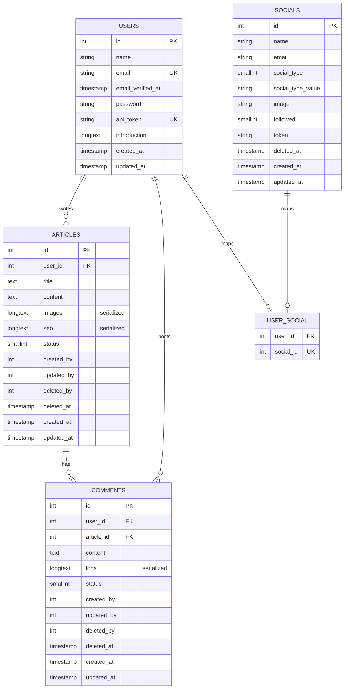
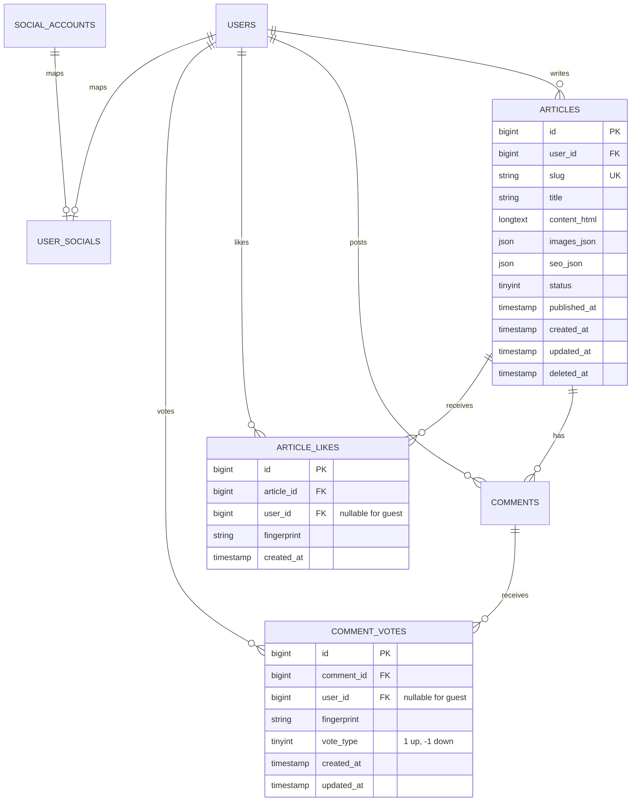

# 詳細 ERD（現況 + 重做建議）

## 現況 ERD（依 migration 彙整）

## 主要索引（現況）

- `users.email` unique
- `users.api_token` unique
- `articles`: index(`deleted_by`, `status`)
- `comments`: index(`user_id`, `article_id`, `status`)
- `socials`: index(`email`, `social_type`)
- `user_social`: index(`social_id`, `user_id`) + `social_id` unique

## 欄位字典（現況）

## users

- `id`: 使用者主鍵
- `name`: 顯示名稱
- `email`: 唯一信箱
- `api_token`: 舊系統 API token
- `introduction`: 個人簡介

## articles

- `user_id`: 作者 ID
- `title`: 文章標題
- `content`: HTML 內容
- `images`: 序列化圖片資訊
- `seo`: 序列化 SEO 結構
- `status`: 狀態（1 通常為公開）

## comments

- `user_id`: 留言者 ID
- `article_id`: 所屬文章
- `logs`: 編輯歷程（序列化）
- `status`: 留言狀態

## socials / user_social

- `social_type`: 社群來源（Line/Facebook/Google...）
- `social_type_value`: 第三方唯一識別
- `followed`: 是否與 BOT 成為好友

## 重做版 ERD 建議（強烈建議）

### 建議重點

- 把 `serialized` 欄位改成 JSON
- 新增互動資料表（文章按讚、留言投票）
- viewer 線上狀態保留在快取，不落 DB（或以事件表離線聚合）

## 遷移注意事項

- `articles.id` 建議保留，以維持現有 SEO URL。
- `seo/images/logs` 序列化資料需一次性轉 JSON。
- `comments_count` 建議使用 `withCount` 或 materialized counter（高流量時）。
